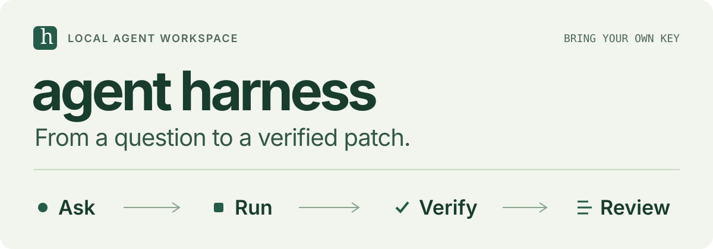
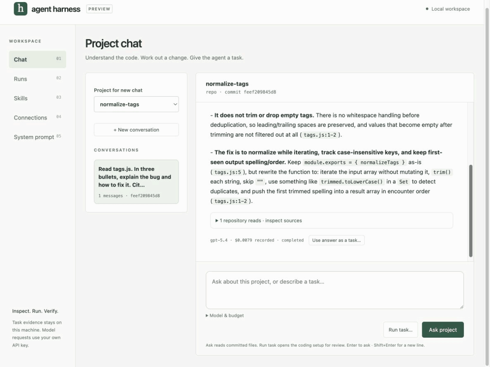

<p align="center">
  
</p>


**Ask about your code. Delegate a task. Review a verified patch.**

A local CLI and project chat for coding work with a budget, an independent verifier, and a record of what happened. Bring your own OpenAI key. Run questions against committed project files, then turn the conversation into an isolated coding run. Your source checkout stays unchanged.


[Get started](docs/getting-started.md) · [Chat & integrations](docs/ui-and-integrations.md) · [How it works](docs/architecture.md) · [Roadmap](docs/roadmap.md)

## See it work

<p align="center">
  
</p>

A real GPT-5.4 question and coding run on the bundled tag-normalization project. The agent reads the file, proposes a change, and produces a patch that passes the independent verifier. **$0.0288 estimated model cost**, including the question; sandbox cleanup confirmed. Selected UI captures with shortened pauses, not a timing benchmark. [Full-size GIF](assets/readme/demo.gif) · [Still image](assets/readme/demo-poster.png) · [Run receipt](docs/evidence/2026-09-06/project-chat/summary.json).

## What makes this a harness

The useful output is a patch with evidence you can inspect. The controller owns the limits and verification around the model.

| Capability | What you get |
| --- | --- |
| **Project chat** | Persistent conversations, read-only code questions, numbered source reads, and an editable handoff to coding tasks. |
| **Bounded execution** | Model/context controls, output reservations, dollar and token limits, timeouts, and cancellation. |
| **Independent verification** | A prepared verifier runs outside the agent's control. A coding task completes only when its checks pass. |
| **Isolated workspaces** | Docker locally or explicitly configured AWS AgentCore. Agent commands have no network or host credentials. |
| **Inspectable evidence** | Patches, usage, ordered events, prompt/tool manifests, cleanup status, and native AgentTrace exports for coding runs. |
| **Evaluated improvement** | Budgeted compaction, scoped versioned skills, observations, paired evaluations with holdouts, promotion gates, and rollback. |

The improvement loop proposes skill revisions and tests them before activation. It does not establish general self-improving performance. See the [learning mechanism and live evidence](docs/compaction-and-learning.md).

## Try it locally

**Private preview:** repository access is required. [Install a checksummed macOS/Linux archive or build from source](docs/getting-started.md). You need Git and an OpenAI API key; coding runs also need Docker. The UI is embedded in the binary—no frontend installation or harness account.

```sh
harness auth login
harness init harness-demo
cd harness-demo
docker pull node:22-alpine
harness serve --task harness.task.json
```

Open the private local link printed by `serve`. Ask a question in **Chat**, or describe a change and choose **Run task…**. Review the goal, model, skills and budget before starting. The generated demo permits up to **$0.50 estimated model spend per coding run**; the UI can lower that ceiling. Setup is unpaid. Submitting a question or starting a run makes real API requests.

`auth login` uses hidden input and an owner-only local key file. You can instead supply `OPENAI_API_KEY` through your secret manager. Keys never pass through the browser or upload to GitHub during setup. [BYOK storage and precedence](docs/getting-started.md#bring-your-own-key).

Prefer the terminal?

```sh
harness doctor                 # Unpaid configuration checks
harness run                    # Real, billable coding run
harness list
harness status RUN_ID
harness trace setup            # Optional native AgentTrace dependency
harness trace RUN_ID
```

State and patches live under `.harness/`. Use `--state-dir PATH` consistently when working elsewhere. [CLI and setup guide](docs/getting-started.md).

<details>
<summary><strong>Use your own repository and verifier</strong></summary>

```sh
harness init --repo /path/to/repo \
  --goal 'Fix the parser for empty input' \
  --image my-project-env:dev \
  --verifier /path/to/independent-checks.sh \
  --max-usd 0.50 parser-task
cd parser-task
harness doctor
harness serve --task harness.task.json
```

Only committed files are used. Prepare dependencies in the image because agent commands have no network. Choose checks that actually establish your task's requirements. A passing verifier means those checks passed, not that arbitrary generated code is correct. [Task setup](docs/getting-started.md).

</details>

## Configure and connect

```sh
harness models
harness config set --model gpt-5.4 --context-window 32768 \
  --max-output-tokens 2048 --max-usd 0.20
harness config show
```

The context window covers input plus reserved output for one request; the total-token budget covers the whole run. GPT-5.4, GPT-5.4-mini and their configured snapshots are supported. Unknown model prices fail closed. [Model and context settings](docs/getting-started.md#model-and-context-settings).

- **MCP:** Streamable HTTP with explicit server/tool selection, pinned schemas, bounded calls and policy rechecks. [Connect an MCP server](docs/ui-and-integrations.md#mcp).
- **GitHub:** Authenticate with host `gh`, clone private repositories, and grant tasks read access to selected issues, PRs, diffs and checks. Credentials stay outside the sandbox. [GitHub setup](docs/ui-and-integrations.md#github-and-git-credentials).
- **Skills and learning:** Import repository-scoped guidance, pin versions, evaluate proposed revisions, then promote or roll back. [Compaction and learning](docs/compaction-and-learning.md).
- **AgentTrace:** Export real coding-run events through its native reader and replay tools. [Trace integration](integrations/agenttrace/README.md).
- **AWS AgentCore:** Run coding commands in fresh microVM sessions with artifact transfer and confirmed teardown. [AWS setup and evidence](docs/aws-harness.md).

## Current boundaries

This is a local, single-user preview. Ask mode reads a pinned Git commit; it does not see dirty/untracked files or call external integrations. Conversations use recent bounded history, display omission counts, and survive restarts. Interrupted model calls are never silently replayed; billing can be unknown. [Chat behavior and limits](docs/ui-and-integrations.md#project-chat).

Coding runs retain private repository content and tool output in their evidence. Exports are manual. Model cost is an estimate from configured prices and reported usage, separate from infrastructure and external-service charges. Docker shares a kernel and is not a multi-tenant security boundary.

Token-by-token chat streaming, attachments, UI task/verifier creation, reviewed GitHub writes, MCP OAuth/stdio, automatic crash resume, distributed workers and disk quotas remain pending. Distill, ContextLab, ThinkBudget and LLMTraceFX adapters are planned. OpenAI is the implemented model provider. [Full roadmap](docs/roadmap.md).

## Development

```sh
go test -race ./...
HARNESS_DOCKER_TEST=1 go test -count=1 ./internal/sandbox ./internal/runner
go vet ./...
```

[CI tests](https://github.com/Siddhant-K-code/agent-harness/actions/workflows/ci.yml) · [Platform package builds](https://github.com/Siddhant-K-code/agent-harness/actions/workflows/package.yml)

Tests cover real Git boundaries, Docker isolation, SDK/MCP protocols, budget admission, cancellation, persistence and recovery. Test doubles are confined to tests; production uses real model and executor paths. [Architecture](docs/architecture.md) · [Recovery](docs/recovery.md) · [Evidence](docs/evidence/2026-09-06/project-chat/README.md).

Distribution remains **private**, the license is undecided, and macOS binaries are not notarized. [Distribution status](DISTRIBUTION.md).
