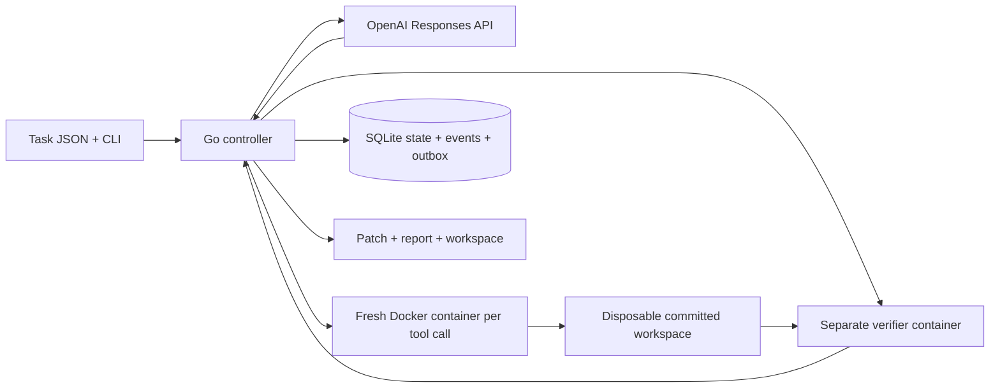

# Runtime architecture

## Boundaries

The controller owns credentials, budget admission, lifecycle transitions, Git history, and the verifier. The model owns proposals: commands, edits, and a completion request. The model cannot mark the durable run completed directly.

`internal/task` validates a versioned JSON contract with explicit limits. `internal/workspace` clones a resolved commit and moves its Git metadata outside the container mount. `internal/model` implements stateless Responses conversations, preserving complete output items and encrypted reasoning continuation. It disables automatic retries because an ambiguous API failure may already have incurred charges.

`internal/sandbox` invokes the Docker CLI without a host shell. The model's shell script is passed only to `/bin/sh` inside the restricted container. Every command has a new container and temporary directory; only repository files persist. The controller resolves the image tag once and executes its content ID throughout the run.

`internal/runner` checks input tokens and reserves maximum output cost before generation. It serializes tool calls, logs requests before executing them, and returns real output and exit codes. Captured stdout and stderr are each limited to 64 KiB and drained after truncation. The verifier is executed from the controller's snapshot; its content hash identifies the exact check that ran. Failure feedback is passed to the model until the repair or step budget is exhausted.

`internal/store` uses SQLite WAL with synchronous FULL and BEGIN IMMEDIATE transactions. State, event, and outbox rows commit together. Cancellation requested before a terminal write wins over completion. SIGINT/SIGTERM also cancel the worker. Docker cleanup uses a separate deadline because killing a CLI client does not necessarily stop its container.

## Data

Run states: `queued → running → completed | failed | timed_out | cancelled`, with `cancelling` as the operator-requested intermediate state. A queued cancellation finishes immediately. `completed` requires verifier success and successful patch capture.

Events have a run ID, monotonically increasing sequence, type, UTC timestamp, and JSON payload. Types currently include `run.created`, `run.started`, `workspace.ready`, `model.requested`, `model.responded`, `tool.requested`, `tool.finished`, `verification.finished`, `run.cancel_requested`, and `run.finished`.

Response IDs are evidence, not workspace checkpoints. Event journaling does not provide exactly-once external side effects. There is deliberately no automatic crash replay until uncertain in-flight tool calls and API requests can be reconciled.

The final patch includes tracked changes, deletions, new files, binary changes, and symbolic links. Git runs with host configuration and hooks disabled. Submodules are rejected explicitly in this first version.

## Current limits

This is a local single-worker runtime. It lacks leases, crash recovery, disk quotas, artifact redaction, model compaction, remote execution, and production-grade adversarial verification. SQLite outbox rows are durable but are not yet delivered anywhere. No AgentTrace integration is claimed until an adapter is implemented and tested against that project's supported event schema.

API references: [Responses](https://developers.openai.com/api/docs/guides/migrate-to-responses), [function calling](https://developers.openai.com/api/docs/guides/function-calling), [Docker execution](https://docs.docker.com/engine/containers/run/).
