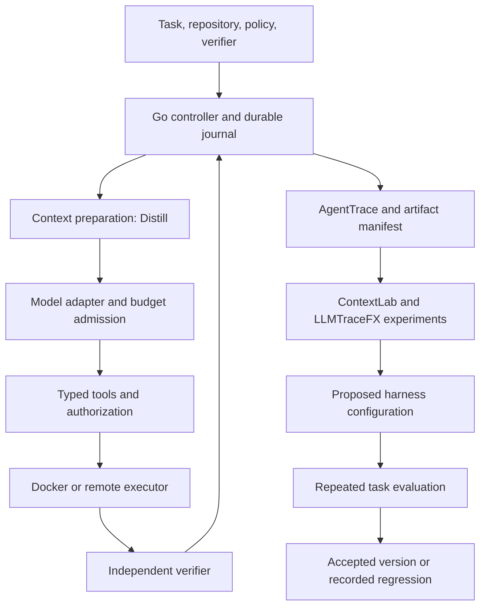

# Native integrations and the improvement loop

Design and implementation status, September 5, 2026. The [local runtime](architecture.md) and [AgentTrace batch export](../integrations/agenttrace/README.md) for both local runs and remote command journals are implemented. Other adapters and incremental delivery below remain proposed. This plan follows inspection of the linked projects' code.

## Product direction

Build a coding runtime whose improvements can be demonstrated on verified tasks. Each run should explain what context it received, which actions were authorized, what executed, what verification found, and what the outcome cost. Those records become experiments for the next harness change.

Siddhant's [internal platform article](https://siddhantkhare.com/writing/building-an-internal-platform-for-ai-agents) supports separating durable control, disposable execution, identity, context, and verification. His articles on [retries](https://siddhantkhare.com/writing/retry-is-not-a-loop) and [delegated authority](https://siddhantkhare.com/writing/your-agent-should-not-inherit-your-admin-token) translate into explicit attempt state and authorization at dispatch time. These are constraints for this design, not claims that the current runtime already meets them.

Huntley's [agent workshop](https://ghuntley.com/agent/) and [loop essay](https://ghuntley.com/loop/) support a small, inspectable loop, focused tasks, and selective tools. Apply this by improving one failure mode at a time using checks and traces. His [environment work](https://ghuntley.com/slash-new/) motivates reproducible toolchains. Nix or devcontainers can describe those toolchains; isolation remains a separate backend responsibility. Only publicly accessible writing informed this plan. [Loom](https://github.com/ghuntley/loom) is an architectural reference with a proprietary license, not a proposed code dependency.

The experiment stage proposes changes. It cannot grant permissions, rewrite the verifier, or silently deploy a new policy.

## Integration contracts

Keep the projects in their own repositories and pin dependencies. Use Go packages for synchronous work, a local bridge for a Python-owned format, and versioned artifacts for offline analysis. MCP belongs at the external tool boundary; it is not the transport for every component.

Every adapter needs a contract version, dependency revision, cancellation behavior, and declared failure mode. Shared identities include run, attempt, source sequence, request/call IDs, repository commit, environment digest and architecture, task/verifier hashes, harness revision, policy version, and context configuration. Artifacts carry content hashes, capture origin, sensitivity, and truncation status. Unknown billing and missing measurements stay explicit. Recovery uses the private journal; exported evidence is a separate minimized projection.

## 1. AgentTrace: native evidence first

Use the actual Python `TraceEvent`, `SessionMeta`, and `TraceStore` interfaces. The inspected baseline is [agent-trace at b109ec5](https://github.com/Siddhant-K-code/agent-trace/tree/b109ec5b3714b842746e97ee8e975329d8582667). Its native directory contains `meta.json` and `events.ndjson`; its `import` command parses Claude Code logs, so it is not a generic harness-event importer. See the [models](https://github.com/Siddhant-K-code/agent-trace/blob/b109ec5b3714b842746e97ee8e975329d8582667/src/agent_trace/models.py), [store](https://github.com/Siddhant-K-code/agent-trace/blob/b109ec5b3714b842746e97ee8e975329d8582667/src/agent_trace/store.py), and [importer](https://github.com/Siddhant-K-code/agent-trace/blob/b109ec5b3714b842746e97ee8e975329d8582667/src/agent_trace/jsonl_import.py).

Implemented local and remote slices:

1. `internal/trace/agenttrace` embeds a pinned Python bridge; installation and usage are in `integrations/agenttrace`. Python is needed for export, not for running the agent.
2. Export a terminal run through `TraceStore` into a private staging directory. Validate with AgentTrace's reader, then publish the complete directory atomically.
3. Derive stable event IDs from run, attempt, source sequence, and projection version. Record source high-water mark and redaction policy in a manifest. Repeating an identical export is idempotent; a conflicting existing export is an error.
4. Reuse AgentTrace's replay and comparison tools. The existing GPT-5.4 run and the [live isolated AWS probe](evidence/2026-09-05/aws-isolation/README.md) load through the real reader and replay renderer without new model spend. Remote export uses actual pre-call intent and post-call observations; a controller disconnect never becomes a fabricated command result.

| Harness evidence | AgentTrace projection |
| --- | --- |
| Actual start and terminal outcome | `session_start`, `session_end` |
| Model request and received response | `llm_request`, `llm_response`, correlated through `parent_id` |
| Dispatched tool and observed result | `tool_call`, `tool_result`, preserving call identity |
| Verifier result | Controller-owned check in structured outcome data, with verifier and candidate hashes |
| Other lifecycle and policy records | Versioned harness sidecar referenced by the manifest |

Put harness fields under `data.harness`; do not invent enum values or label controller actions as model reasoning. Initially use one session for the existing single attempt. Recovery later introduces one session per attempt, correlated by run ID; do not invent history for old runs.

Coverage is part of the result. We observe model calls, dispatched scripts, captured output, verifier results, and selected artifacts. We do not observe every file read or syscall inside a shell command, or hidden model reasoning. Never infer `file_read` events from a command string. Incomplete calls remain incomplete. Record truncation and omissions. Default export should allowlist metadata and redact selected content before it leaves private storage; heuristic redaction cannot guarantee that arbitrary source or output contains no secrets.

Follow with incremental outbox delivery once the batch format is stable. Delivery is at least once: detect duplicate IDs and conflicting payloads, recover partial writes, and acknowledge only durable output. `TraceStore.append_event` alone is not an idempotency protocol. Use per-sink cursors when adding multiple sinks.

Acceptance: AgentTrace loads the real run; parent links and usage match; duplicate export adds no events; injected secret markers are absent; interrupted export never appears complete. Later fault tests cover crashes between sink persistence and acknowledgement.

## 2. Distill: context preparation in Go

The [public pipeline](https://github.com/Siddhant-K-code/distill/blob/main/pkg/pipeline/pipeline.go) accepts typed chunks and configurable deduplication, compression, and summarization. Call `pipeline.New().Run(...)` from a Go adapter. Semantic deduplication expects embeddings in the input, and its token counts are estimates.

Start with retrieved repository/document text. Attach source path, revision, hash, trust level, and selection reason before transformation. Preserve task requirements, permission boundaries, and acceptance criteria exactly. Never compress Responses protocol items, tool-call IDs, or opaque encrypted continuation data.

Compare unchanged retrieval, exact deduplication, and Distill extraction/compression on the same task corpus. Add semantic deduplication only with an explicit embedding provider, cost accounting, and embedding identity. Keep lossy summarization opt-in. The existing model token-counting and admission logic remains authoritative for spending.

Later adopt scoped memory with provenance and expiry. Model assertions from failed attempts must not become trusted facts automatically. Acceptance: source references survive, protected content is unchanged, and verified completion is reported alongside token savings.

## 3. agentic-authz and OpenFGA: authorize tool effects

[agentic-authz](https://github.com/Siddhant-K-code/agentic-authz) describes itself as a reference demo. Its handler accepts caller-supplied identity context and contains a mock execution path. Reuse the design through a hardened adapter and the OpenFGA Go SDK; do not treat that handler as a production gateway.

Authenticate the sponsor outside the model. At every external dispatch, intersect current relationship permissions with the task's capability grant: operation, resource, validated argument hash, expiry, and policy version. Fail closed on authorization errors. Record the decision and dispatch together. Distinguish sponsor, workflow, worker, and deployment identity.

The broker holds scoped credentials outside the worker. Network policy must prevent bypass; a tool allowlist cannot constrain arbitrary shell effects by itself. Start with read-only GitHub issue, diff, and check-log access. Add mutations with task-scoped authority and idempotency. Acceptance includes forged identity, revoked access, out-of-scope repository, stale grant, and policy-service outage cases.

## 4. ContextLab, ThinkBudget, and LLMTraceFX: evaluate policies

| Project | Native connection | Boundary |
| --- | --- | --- |
| [ContextLab](https://github.com/Siddhant-K-code/ContextLab/blob/main/contextlab/__init__.py) | Offline Python analysis of context manifests and selection/compression experiments. | Establish which optimizer improves outcomes before combining optimizers. |
| [ThinkBudget](https://github.com/Siddhant-K-code/ThinkBudget/blob/main/src/thinkbudget/proxy.py) | Experimental budget advice translated into provider-supported parameters. | Its Chat Completions proxy targets visible `<think>` output. It cannot directly enforce GPT-5.4 hidden-reasoning limits; monetary admission stays in the harness. |
| [LLMTraceFX](https://github.com/Siddhant-K-code/LLMTraceFX/blob/main/llmtracefx/optimizer/compare/evidence.py) | Evidence adapter and shared identity for verified experiments. | Its loader requires verified workload artifacts and provider evidence. Our `report.json` is not currently ingestible. |

For LLMTraceFX, separate model-request measurements from whole-task measurements. A multi-call coding workflow is not a single inference workload. Add a reviewed workflow comparison schema rather than relabeling our report as `verification.json`. Preserve actual request settings, model/evaluator identities, repetitions, and API accounting. GPU measurements unavailable from a hosted API remain null.

Track verified completion, total cost divided by verified successes (including failed attempts), wall time, repairs, infrastructure failures, and recovery. At zero successes, cost per success is undefined. Record human review time only when measured. Hold model and environment constant when testing context policies; disclose system differences when comparing providers.

## 5. Other projects and tools

[actionsec](https://github.com/Siddhant-K-code/actionsec) fits as a pinned, bounded verifier step when candidates change GitHub Actions workflows. GitHub1s can provide a review entry point once a patch exists in a repository. The Agentic Engineering Guide supplies short task playbooks whose important rules become executable checks.

Add structured repository search/read/edit, language diagnostics, and browser verification where tasks need them. Select MCP tools per task and route them through the broker. Follow the [MCP security guidance](https://modelcontextprotocol.io/docs/2025-11-25/tutorials/security/security_best_practices); transport compatibility does not establish authorization.

Keep GPU-serving projects and additional orchestrators outside the initial dependency graph. Add them when an experiment needs their capability. Next: AgentTrace, backend/recovery contracts, then the [AWS experiment](execution-backends.md). See the [ordered roadmap](roadmap.md).
